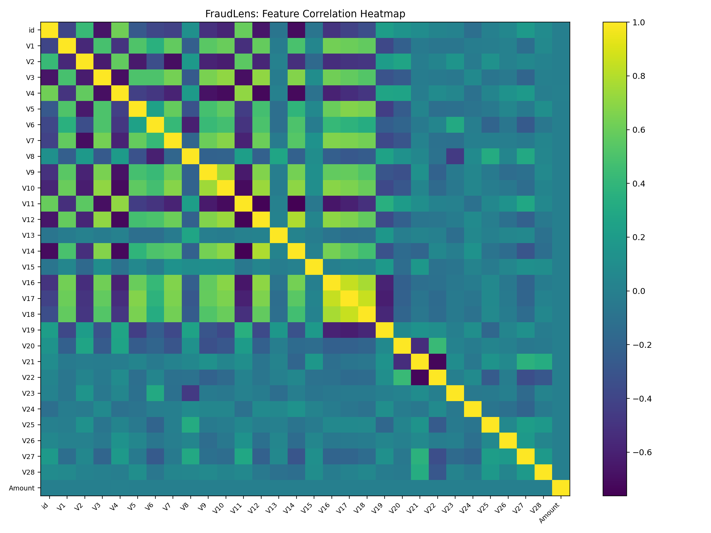

🛡️ FraudLens: AI-Powered Transaction Fraud Detector

FraudLens is an end-to-end ML system for detecting fraudulent transactions (banking, e-commerce, digital wallets).
It combines feature engineering, supervised ML, and explainability to produce fraud risk scores and interpretable predictions.

🔑 Features

Transaction Monitoring

Input: transaction logs (amount, time, location, device, merchant)

Output: risk score (0–1) + predicted label (0 = Legit, 1 = Fraud)

Machine Learning

Balanced Logistic Regression (default)

Handles imbalanced datasets with class_weight='balanced'

ROC-AUC and PR-AUC evaluation

Explainability

Feature importance ranking (coef magnitudes)

Classification reports & confusion matrices

Threshold tuning for precision vs. recall

Visualization

Feature correlation heatmap

Accuracy curve over epochs

ROC & Precision-Recall curves

Confusion matrix heatmap

Deployment

Batch inference script (fraudlens_batch_infer.py)

FastAPI real-time scoring service (fraudlens_api.py)

📂 Project Structure
FraudLens/
├─ archive/
│   └─ creditcard_2023.csv         # dataset (Kaggle credit card fraud detection)
├─ fraudlens_train_predict.py      # training + metrics + plots
├─ fraudlens_batch_infer.py        # batch inference CLI
├─ fraudlens_api.py                # FastAPI service for scoring
├─ outputs/                        # all generated artifacts
│   ├─ fraudlens_model.pkl
│   ├─ fraudlens_test_predictions.csv
│   ├─ fraudlens_metrics.json
│   ├─ fraudlens_feature_corr_heatmap.png
│   ├─ fraudlens_accuracy_over_epochs.png
│   ├─ fraudlens_confusion_matrix.png
│   ├─ fraudlens_roc_curve.png
│   ├─ fraudlens_pr_curve.png
│   └─ fraudlens_feature_importance.csv
└─ README.md

📊 Dataset

We recommend the Credit Card Fraud Detection (ULB)
 dataset:

284,807 transactions

492 fraud cases (~0.17%)

Features: Time, Amount, V1…V28 (PCA-transformed features)

Label: Class (0 = legit, 1 = fraud)

Place your dataset under:

C:\Users\sagni\Downloads\FraudLens\archive\creditcard_2023.csv

⚙️ Installation
pip install pandas numpy scikit-learn matplotlib joblib fastapi uvicorn pyyaml tables

🚀 Usage
1) Train & Evaluate
python fraudlens_train_predict.py

Outputs:

fraudlens_model.pkl (trained pipeline)

Metrics & plots (ROC, PR, confusion matrix, feature importance)

2) Batch Inference

Score a new CSV with the saved model:

python fraudlens_batch_infer.py \
  --model "C:\Users\sagni\Downloads\FraudLens\fraudlens_model.pkl" \
  --csv   "C:\path\to\new_transactions.csv" \
  --outdir "C:\Users\sagni\Downloads\FraudLens"

Outputs:

fraudlens_scored.csv → predictions + fraud probabilities

fraudlens_scored_metrics.json (if ground truth labels present)

3) Real-Time API

Launch FastAPI service:

uvicorn fraudlens_api:app --host 0.0.0.0 --port 8000

Example request:

curl -X POST "http://127.0.0.1:8000/score" \
     -H "Content-Type: application/json" \
     -d '{"data": {"Time": 1000, "Amount": 200.5, "V1": -1.23, "V2": 0.98}}'

Response:

{"prob_fraud": 0.87, "y_pred": 1}

📈 Outputs

Heatmaps: feature correlations & confusion matrix

Curves: ROC & PR curves, accuracy over epochs

Metrics: ROC-AUC, PR-AUC, confusion matrix counts, classification report

Artifacts: pickled model, predictions CSV, feature importance CSV

🔮 Future Extensions

Graph-based fraud ring detection with Neo4j

Real-time streaming with Kafka

Integration with payment APIs (Stripe sandbox, PayPal)

Multi-language fraud alerts (SMS/email)

Auto-threshold tuning for recall/precision tradeoffs
Author

SAGNIK PATRA
